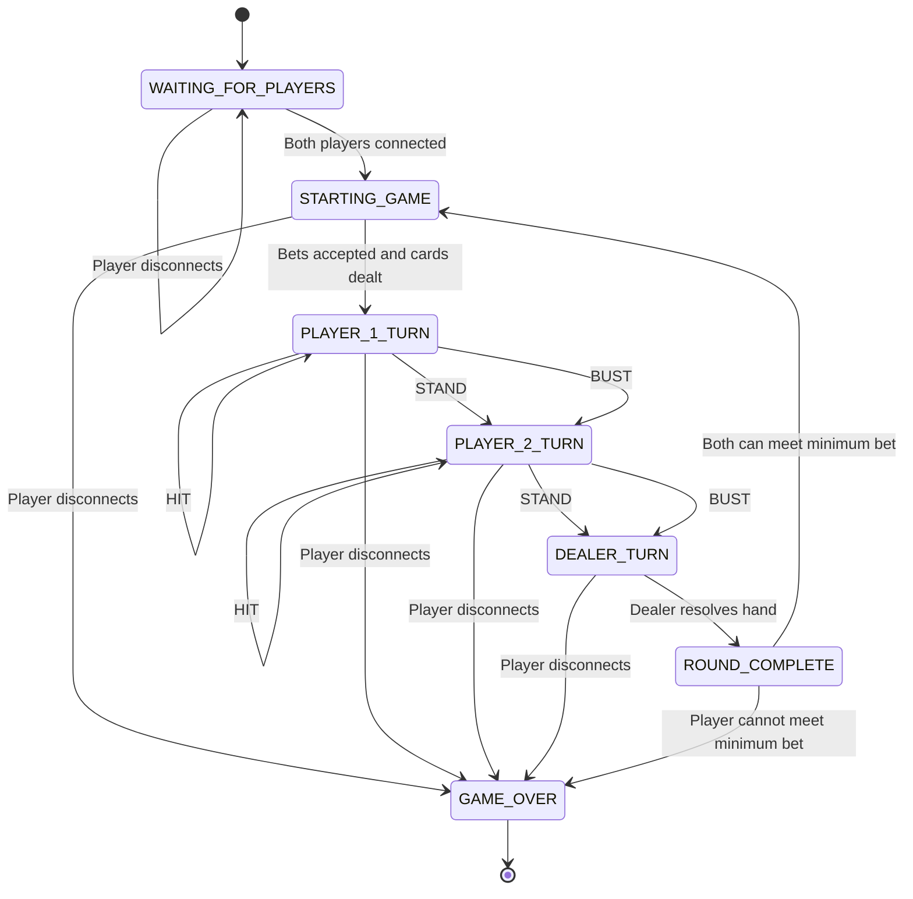

# Game State Machine Overview
> The blackjack game will operate as a server-controlled finite state machine. This server will manage the player's connections, game initialization, player turns, dealer turns, and game completion. The clients will request actions, and the server will validate those action while controlling state transitions. Each player has a bankroll, with the server controlling the players betting and updating the bankroll. The game ends when a player forfeits/disconnects or can no longer meet the minimum bet.

## State Descriptions
- **WAITING_FOR_PLAYERS:** Server is waiting for both players to connect.

- **STARTING_GAME:** Both players have connected, roles assigned, bets collected, and intial hands dealt

- **PLAYER_1_TURN:** Player 1 chooses to HIT or STAND

- **PLAYER_2_TURN:** Player 2 chooses to HIT or STAND

- **DEALER_TURN:** Both players are finished, so server follows set dealer rules to resolve round

- **ROUND_COMPLETE:** Server determines winner/draw and sends result including resolving bets, updating player bankrolls, and determining if another round can begin.

- **GAME_OVER:** Game ends, either because of forfeit/disconnected player or player can no longer meet minimum bet

## Valid Transitions
1. WAITING_FOR_PLAYERS
    - -> STARTING_GAME
2. STARTING_GAME
    - -> PLAYER_1_TURN
3. PLAYER_1_TURN
    - -> PLAYER_1_TURN     (HIT)
    - -> PLAYER_2_TURN     (STAND or BUST)
4. PLAYER_2_TURN
    - -> PLAYER_2_TURN     (HIT)
    - -> DEALER_TURN       (STAND or BUST)
5. DEALER_TURN
    - -> ROUND_COMPLETE
6. ROUND_COMPLETE
    - -> STARTING_GAME     (both players meet minimum bet)
    - -> GAME_OVER         (game session ends)

## Player Guided Transitions
- **PLACE BET:** Player submits a valid bet before the round begins
- **HIT (Dealing):** Remain in current player's turn for another dealt card.
- **STAND:** Advance to next player turn.
- **HIT (Bust):** Auto advance to next state.
- **STAND/BUST (Final Player):** Transition to DEALER_TURN
- **Quit:** DISCONNECT

## Invalid Actions - ERROR Message
- Player sends MOVE when it isn't their turn
- Player sends something other than HIT or STAND
- Player tries to HIT or STAND after ending their turn
- Incomplete message
- Invalid player ID

## Player Disconnects
- **During WAITING_FOR_PLAYERS:** Remove disconnected player and remain in WAITING_FOR_PLAYERS
- **During active game:**
1. Player intentionally disconnects: Opponent wins by forfeit and transitions to GAME_OVER
2. Player unexpectadly loses connection: Server detects socket error, opponent wins by forfeit and transitions to GAME_OVER

## Game Completion
- **Round Complete:** The server determines each player's result, resolves their bets, and updates their bankrolls. If both players have enough money to meet the minimum bet for another round, the server begins a new round. If either player cannot meet the minimum bet, the game ends and the player is declared bankrupt/losing player.

## Mermaid Diagram

